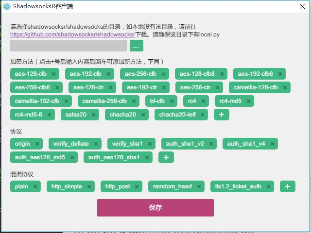
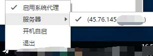

# electron-ssr
Shadowsocksr client that coding with electron and vue
[中文版说明](./README.md)

## Feature
- Close to tray
- Crash Reporting
- Update and launched notification
- Support all of the shadowsocksr python version's function

## Pre-requirement
- [python](https://www.python.org/downloads/) to be installed

## Screenshot




## Download
Go to [release](https://github.com/erguotou520/electron-ssr/releases)

## Update history
- 0.1.1
  * use `child_process` to run `python` command for all platform as `root` permission is required by `-d` mode in linux
  * fix some config bug and logical issue
  * hide icon in dock for mac
  * open config file from tray
- 0.1.0
  * Support to open log file
  * Deamon mode for unix system using `-d` while child process for windows
  * Support `ssr://` and `ss://` conversion to each other
  * Support scan screen qrcode
  * Support to add ssr methods and protocols and obfses
  * Now need to set `shadowsocksr` python path

## Config and log file path
* windows: `C:\Users\{your username}\AppData\Local\Programs\electron-ssr`
* linux: `~/.config/electron-ssr`
* mac: `~/Library/Application Support/electron-ssr`

## Build Setup

``` bash
# install dependencies
npm install

# serve with hot reload at localhost:9080
npm run dev

# lint all JS/Vue component files in `app/src`
npm run lint

# run webpack in production
npm run pack

# build electron app for production
npm run build

# remove all files under builds
npm run build:clean

# qrcode scheme unit test
npm run test:unit
```

## ShadowsocksR Doc Reference
- [Python client setup (Mult language)](https://github.com/breakwa11/shadowsocks-rss/wiki/Python-client-setup-(Mult-language))
- [SSR QRcode scheme](https://github.com/breakwa11/shadowsocks-rss/wiki/SSR-QRcode-scheme)
