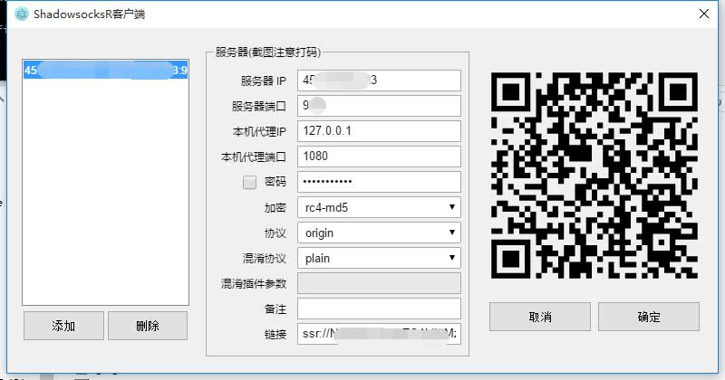

# electron-ssr
Shadowsocksr client that coding with electron and vue

## Feature
- Close to tray
- Crash Reporting
- Update and launched notification
- Support all of the shadowsocksr python version's function

## Pre-requirement
- [python](https://www.python.org/downloads/) to be installed

## Screenshot


## Download
Go to [release](https://github.com/erguotou520/electron-ssr/releases)

## Some tips
* windows setup exe file will install this project to `C:\Users\{your username}\AppData\Local\Programs\electron-ssr`

## Build Setup

``` bash
# install dependencies
npm install

# serve with hot reload at localhost:9080
npm run dev

# lint all JS/Vue component files in `app/src`
npm run lint

# run webpack in production
npm run pack

# build electron app for production
npm run build:win32
npm run build:darwin
npm run build:linux

# qrcode scheme unit test
npm run test:unit
```

## ShadowsocksR Doc Reference
- [Python client setup (Mult language)](https://github.com/breakwa11/shadowsocks-rss/wiki/Python-client-setup-(Mult-language))
- [SSR QRcode scheme](https://github.com/breakwa11/shadowsocks-rss/wiki/SSR-QRcode-scheme)
