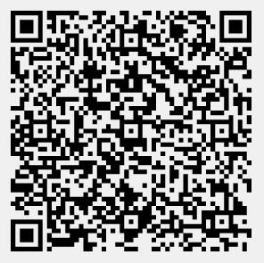
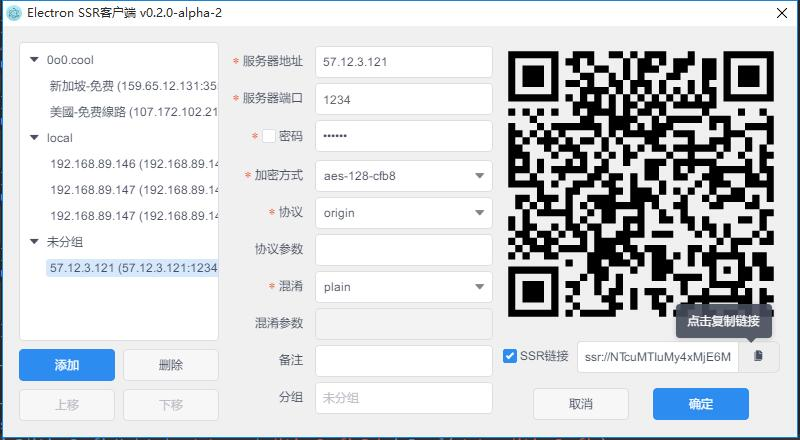
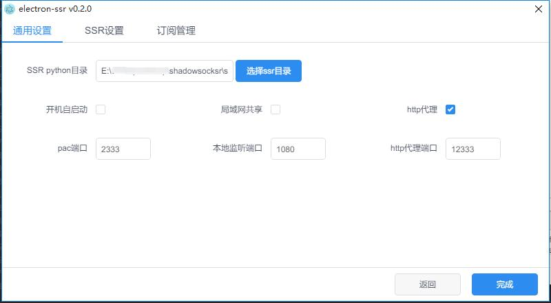
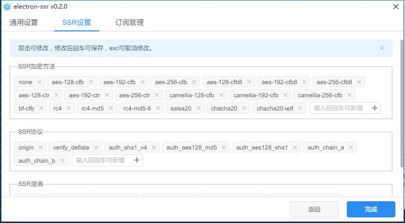
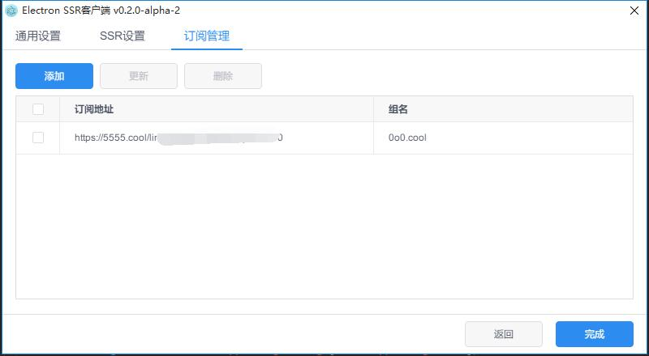
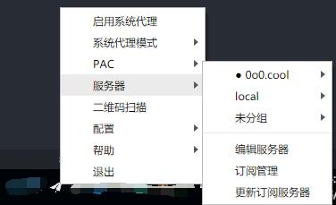

# ShadowsocksR跨平台客户端

这是一个跨平台（支持Windows MacOS Linux系统）的`ShadowsocksR`客户端桌面应用，它功能丰富，支持windows版大部分功能，更有更多人性化功能。它是开源的，它来源于开源，回馈以开源。

## 功能特色

- 支持手动添加配置
- 支持服务器订阅更新，复制该地址测试

  `https://raw.githubusercontent.com/erguotou520/electron-ssr/redesign/docs/assets/subscribe.txt`
- 支持二维码扫描(请确保屏幕中只有一个有效的二维码)，扫描该二维码测试

  
- 支持从剪贴板复制、从配置文件导入等方式添加配置
- 支持复制二维码图片、复制SSR链接(右键应用内二维码，点击右键菜单中的复制)
- 支持通过点击ss/ssr链接添加配置并打开应用(仅Mac和Windows)，[因Github平台限制，请前往该地址点击测试](https://erguotou520.github.io/electron-ssr)
- 支持切换系统代理模式:PAC、全局、不代理
- [内置http_proxy服务](docs/HTTP_PROXY.md)，可在选项中开启或关闭
- 支持配置项变更
- 更多功能尽在任务栏菜单中

<!-- ## Telegram交流

[](https://t.me/joinchat/E7ViZhJAZpKtnIJy9WepDA) -->

## 下载

下载地址见[Github release](https://github.com/erguotou520/electron-ssr/releases)，对应的操作系统下载的文件为

- Windows `electron-ssr-setup-x.x.x.exe`
- Mac `electron-ssr-x.x.x.dmg`
- Linux 优先建议下载`electron-ssr-x.x.x.AppImage`，直接双击运行。如果无法使用或者想直接下载自己系统专用包请看下一条
- Arch或者基于Arch的系统，下载`electron-ssr-x.x.x.pacman`
- RedHat系列的系统，下载`electron-ssr-x.x.x.rpm`
- Debian系列的系统，下载`electron-ssr-x.x.x.deb`
- 系统Linux系统或者通用Linux系统可下载`electron-ssr-x.x.x.tar.gz`（不会使用.tar.gz的请自行百度）

## 配置文件位置

- Windows `C:\Users\{your username}\AppData\Roaming\electron-ssr\gui-config.json`
- Mac `~/Library/Application Support/electron-ssr/gui-config.json`
- Linux `~/.config/gui-config.json`

## 快捷键

加入快捷键本来是为了解决部分Linux发行版无法显示图标导致功能无法使用而加入的，当然其它系统也是可以使用的，同时支持在设置中进行开启/关闭以及更换按键的操作。

### 全局快捷键

- `CommandOrControl+Shift+W` 切换主窗口显隐
- `未设置` 切换系统代理

### 应用内快捷键
- `CommandOrControl+Shift+B` 切换是否显示操作菜单，仅Linux可用

## 已知Bug

- 部分Linux系统无法切换系统代理模式（本应用使用`gsetting`设置系统代理，所以有些Linux系统无法使用该功能），如果你知道如何实现，欢迎发issue告知。
- Windows系统切换全局代理不生效

## 应用截图







## FAQ

[FAQ](./docs/FAQ.md)

## Issus

请在发issue前先查看FAQ里的说明能不能解决你的问题。
在发issue前请先在issue中搜索是否有同类issue，如果有请跟帖。
另外发Bug类issue请详细描述你的使用环境，包括但不限于操作系统、软件版本，操作步骤，报错日志等。

## 图标资源

[https://www.figma.com/file/ghtehcxfzu0N2lQPoVEQXeU7/electron-ssr](https://www.figma.com/file/ghtehcxfzu0N2lQPoVEQXeU7/electron-ssr)

欢迎提出改修意见

## 打赏

[](https://www.buymeacoffee.com/erguotou520)

## 开发和构建

``` bash
# or npm install
yarn

# 开发时
npm run dev

# 打包构建
npm run build

# 单元测试
npm run mocha

# 代码风格检查
npm run lint

```

## Changelog更新日志

请直接查看[release发布说明](https://github.com/erguotou520/electron-ssr/releases)

## ShadowsocksR 参考文档

- [ssr-libev](https://github.com/breakwa11/shadowsocksr-libev)
- [ssr-libev 备份](https://github.com/shadowsocksr-backup/shadowsocksr-libev)
- [SSR QRcode scheme](https://github.com/breakwa11/shadowsocks-rss/wiki/SSR-QRcode-scheme)
- [SSR QRcode scheme备份](https://github.com/shadowsocksr-backup/shadowsocks-rss/wiki/SSR-QRcode-scheme)

---

This project was generated with [electron-vue](https://github.com/SimulatedGREG/electron-vue)@[1c165f7](https://github.com/SimulatedGREG/electron-vue/tree/1c165f7c5e56edaf48be0fbb70838a1af26bb015) using [vue-cli](https://github.com/vuejs/vue-cli). Documentation about the original structure can be found [here](https://simulatedgreg.gitbooks.io/electron-vue/content/index.html).
